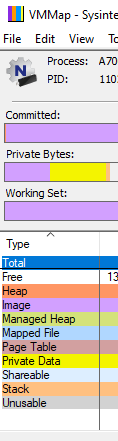
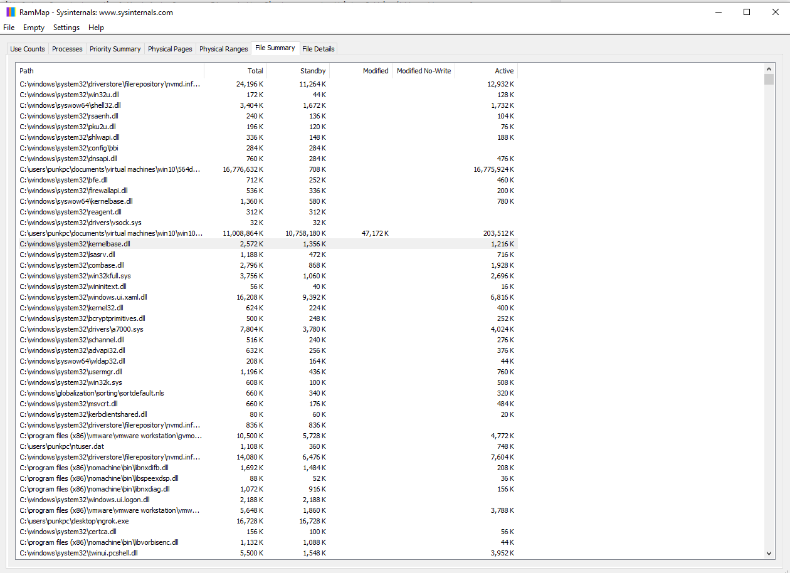

## Welcome to Gray Area: Hackers Notes

Below is a place where I will keep some notes related to hacking, any courses I take, and any research that I do. I'll try to be good about keeping this updated, but if it ever gets out of date, please open an issue and virtually punch me.

## Simple AF network fuzzing with decept and mutiny

Network fuzzing is easy af. I had put off learning how to do it well, I knew the basics and had used BooFuzz and Peach before, and I was honestly just dreading creating a grammar for each one. For thoroughness I should probably do this using Boo - especially for stuff like HTTP [RFC-2616](https://tools.ietf.org/html/rfc2616) we should be able to build a list of all special HTTP headers that may have some special processing functions within an executable that could use some fuzzing. But damn, that would take like... over an hour so f\*ck that. Also according to fuzzguru Richard, and of course this is true but I never thought about it much, mutational fuzzing is often far more effective than generational fuzzing. 

We're on an exercise break now where we're finding a known bug in vshttpd. I don't like finding known things in known places so I'm going ahead and installing a variety of web servers, throwing some packets their way, and fuzzing them using [Decept Proxy](https://github.com/Cisco-Talos/Decept) and the associated [mutiny fuzzer](https://github.com/Cisco-Talos/mutiny-fuzzer) to just get things up and running first. I can fine tune shit later (another recommendation from Richard). Here's how to use decept:

`python decept.py --fuzzer apache2.fuzzer 127.0.0.1 9999 192.168.180.129 80`

All I'm saying there is listen on port 9999 on 127.0.0.1 and send to port 80 on 192.168.180.129, my NAT IP address then save the packet information to apache2.fuzzer, a file with a special grammar similar to one seen in BooFuzz and such that tells it where to fuzz. Decept is nice, it has no dependencies and is super easy to use. Since Decept and Mutiny are meant to be used together we get the .fuzzer file to pass in to Mutiny. This is also a simple bash one-liner

`python mutiny.py -i 192.168.180.129 apache2.fuzzer`

Note that the fuzzfile for now, because it is simply using decept proxy is actually going to fuzz the CONNECT verb here, for better coverage, we should probably generate more traffic, but I leave that as an exercise to the reader (read: go f*** yourself).

Once stuff is up and running you should see:

\*\*\*\*\*\*\*\*\*\*\The Mutiny Fuzzing Framework\*\*\*\*\*\*\*\*\*\*\
jaspadar@cisco.com && liwyatt@cisco.com <(^_^)>|
Monitor locking execution till condition met\
[*] Target detected, fuzzing.\
Message 0, seed: 3380, old len: 197, new len 230\
Message 0, seed: 3381, old len: 197, new len 328\
Message 0, seed: 3382, old len: 197, new len 216\
Message 0, seed: 3383, old len: 197, new len 230\
Message 0, seed: 3385, old len: 197, new len 195\
Message 0, seed: 3386, old len: 197, new len 203


Mutiny will start Mutiny-ing. Boom, we've network fuzzed. Note that mutiny/decept support a pretty decent set of options, you can MITM TLS and SSH traffic, create .fuzzer files from pcaps, and override a bunch of stuff. This is just the basics, but really you can extend the above concept quite a bit to fuzz a bunch of stuff quite quickly. I started fuzzing 3 web servers in about 5-10 minutes (and then wrote this up in another 5). That's pretty damn good.


## Hongfuzz vs. Apache httpd - FIGHT

Hi All, in keeping with the theme of quick iterative notes on wtf I'm up to here is how to get Hongfuzz up and running against apache http. The creators of Honggfuzz have wisely and kindly created a process for fuzzing. That means a lot of people have probably done it and it's a "known" technique. However, I've always found that I think that about any 0-day hunting - "eh, someone has probably looked, I won't spend my time on it". Well, that's how you miss bugs. Also not all fuzzers are deterministic, there's always the chance that I generate better inputs than the last a\*\*hole or that I have more CPU cores to leave it running for longer. Or maybe I'm wasting my time, but hey, then I know I wasted my time at least.

[So check this out](https://fossies.org/linux/honggfuzz/examples/apache/README.md). That's everything you need to get apache running under honggfuzz. Some quick notes on it: download the libs and build them, only use apt for the dependent libraries, you're going to need to build them all and enter the path in several config files, so put your sh\*t somewhere easy to find. I've noticed that there's been an update to honggfuzz and an additional parameter was needed for me to get this running. Below is the full command:

`../honggfuzz/honggfuzz -i corpus_http1/ -w httpd-2.4.46/httpd.wordlist --threads 10 -P -- ./bin/httpd -DFOREGROUND -f conf/httpd.conf.h1`


YDMV (your directories may vary), but note the -P added here. This tells it to run in persistent mode. I'm not convinced this is working well yet, and I'll be updating this post as I play with some of the options a bit more, but at least it runs. I'm getting way more timeouts than is reasonable (i'm at several hundred in just a few minutes), but at least no immediate crashes, which is expected on a hardened codebase like Apache httpds. I'll keep you all posted on results!

## So I went hunting for databases....

Huge shock, I found about 20+ from 2020 and another 20+ from 2019. This brings our total databases in scylla to about 290-300. and about 4.1 TB of data in JSON lines, one record per line. That's a lotta data. Honestly is it even worth learning how to hack anymore?? Just kidding, I live for this shit. Anyway check out scylla.sh over the next few days for the data.


## Sweet sweet sysinternals

So I'm going to go through every sysinternals tool that I deemed "interesting" for 0-day hunting in this post. But don't take my word for it (right Levar Burton!?), look at sysinternals tools for yourself and go through them. I'll be going through them one by one here, but nothing is better than hands on experience using them for 0-day hunting.

I'll start off with some notes here that I'm making about memory changes in the various Windows versions via sysinternal's vmmap. For those of you that don't know I have a project called scylla.sh at https://scylla.sh where I work with very very large (sometimes TB large) file sizes. I primarily use Linux, but it isn't odd that I find a site where I need to use Windows to get it to actually work (the places I go to hunt for free DBs are... interesting). Anyway, point is, sometimes I'm writing python scripts on Windows and when you're talking trillions of lines and terabytes of data things get slooooow. One way to speed things up is by loading as much as I can to memory before performing operations against files. Anyway, you may have your own needs, so you might find the below specifics of Windows memory useful. Most of this information is form https://dzone.com/articles/windows-process-memory-usage-demystified and validated with Windows Internals Part I 7th edition. I'll summarize some of the more "interesting" (I have an odd definition of that) stuff I see below and not just write the exact same thing as that article I linked to.

One thing I learned that I frankly just did not know is that 32-bit virtual memory is limited to 2 GB whereas 64-bit memory is limited to 128TB of memory. That's a pretty huge difference and something to keep in mind when coding on large files.

Comitted vs. reserved memory is an important concept. Reserved mem is not guaranteed to be backed by physical memory (aka shit might not work yo), whereas reserved memory is backed by physical memory (shit will work yo). Committed memory can be shared by multiple processes. There exists a counter in the OS that counts the ammount of committed memory to ensure that processes don't end up using stuff that can't be backed physically. It's very reasonable to have reserved memory be way way higher than the actual physical memory to back it up- if a lot of processes are using a ton of memory then some shit needs to change on your OS (lookin' at you firefox - plug for what I still insist is a 0-day https://mega.nz/file/BmJFiCSa#Ga3wkyLkBE-LZdsgh-1gRCHwFoL9f3LsjUrkOnP9Kow that leads to simple as f*** ASLR bypass and pretty much getting around any memory protection you'd like on any flavor of Linux. According to firefox this was "not a vulnerability" and "detaching a debugger to a process doesn't constitute a vulnerability". Except, well, other processes don't allow it in Linux due to Ptrace protections, firefox does. This is a fun theme in 0-days I see all the time where something is "too simple" to be a 0-day. Hey you're just replacing a dll right? You're just able to arbitrarily read a procs memory right? you're just able to bypass ASLR, get stack canaries, determine readable/writable addresses, get password manager passwords, get system passwords (if run as root) right? Oh wait...

  But I digress. I'm talking about windows here so let's get back to sweet sweet memory and more of those sysinternals tools. Let's talk some more about memory, because it's important. Wtf is this?   Is Windows really telling me that this memory is allocated to the process but isn't usable? wtf? why? Well, Windows memory management for large pages are 64kb aligned (more on pages later) so any memory allocated to a process that doesn't align with the 64kb boundary is lost forever :(. RIP in peace.
  
So some of you might be asking, why does all of this happen? Who's in charge here? Well, it's the massive ntoskrnl.exe file, the main kernel executable.  It's in charge of providing a core set of System services many of which are exposed via the win32 API or kernel devices (aka drivers). I guess it's time to talk a little more about memory pages. In Windows there's really two sizes of pages, from now on I'm only gonna talk about 64-bit Windows because that's the way the world is moving and Windows 10 doesn't come in 32-bit flavor anymore. So fuck it. Read some old books if you want to know more about x86 systems. Sorry I didn't mean to be rude, I'm just kind of tired, but really want to talk more about memory. This is sad. I know this.
  
Anyway, my sad life aside, 64bit processors support small and large pages of sizes 4kb and 2MB respectively. Of course a natural question is when is each one used? Larger pages save a lot of processor time because when seeking an address there's a thing called the translation look-aside buffer (TLB) that holds the addresses of various pages and their mapped hardware memory location and therefore a lot of memory addies. When doing something that requires a lot of memory it's much more efficient to have less entries in the TLB, thus yeah, 2 MB at a time instead of 4KB. Of course allocating that memory takes more, uh, memory, so that's why small pages exist, for memory-inexpensive operations. Remember we're in computer-math-land (base 2) so a kb (defined as 2^10 bytes) is 1024 bytes in base 2. As a side note, I still haven't gotten over the metric prefix kilo being used since the dawn of computers to mean 1024 instead of 1000, but whatever. Anyway, large pages are prone to failure because they have to be aligned on a large-page boundary - this can be thought of as, shit has to happen in 512 small page (4kb * 512 = 2MB) chunks yo so a large allocation can happen from pages 0 (yep we're in computer-land so we start at 0) to 511, or 512-1,023, but not at 550-1,073 for example. This means that it has to find continuous physical memory for it to allocate each page (note this does not mean each page has to be continuous with a previous page, just that memory used in a page must be continuous). This causes what we call fragmentation - remember defragmenting shit all the time back in the day? Yeah, that was just because of this inefficiency. Because memory limits are getting serious now with 128 TB able to be used, Windows 10 has the sense of Huge Pages, which are 1GB or 1024MB, they work very similar to how large pages vs small pages work, just with a bigger number. So to sum all of this confusing shit up, let's say I allocate a buffer `char *buf[1050000]` the OS plays a little game of "how do I get to 1 million 50 thousand bytes using my allowed chunk (page) sizes" and would allocate one large page, 2MB = 1024 kb = 1,048,576 bytes and then one small page = 4kb = 4096 bytes giving us a grand total of 1,052,672 bytes. Still with me? That means 1,050,000 - 1,048,576 = 1424 bytes. So another small page gets allocated, giving us a grand total of 1 large page, 2 small pages, and 2672 bytes left over that are now labeled as "unusable" if you're using vmmap to look at stuff.

So this has a fun side effect for us 0-day hunters. Say we're using ROP to exploit something (if you need a ROP primer check this out: https://blog.hyperiongray.com/pwning-dnsmasq-with-rop/, we need the gadgets in that code to be executable. But aren't the people that create programs and drivers and shit smart enough to make things read-only? After all that's the whole point of DEP right? Well, for efficiency, DEP protects *pages* of memory, meaning that if there's some code that needs to execute 4097 bytes worth of instructions and then have some data that is meant to be read-only, one of two things will happen: Windows is going to allocate 2 small pages and make both of those pages executable (DEP dead - we can use what is meant to be read-only data in our ROP chain) OR the program is going to crash. Which one is better? I'll leave that as an exercise to the reader. 

If you're still reading this, congrats, you're a nerd. So let's talk about paged vs non-paged pool memory in Windows 10. non-paged pool memory is used by stuff that *always definitely totally and absolutely* has a physical memory backing, in other words it's always in memory if your OS is running. This is usually used in things like kernel-mode drivers, IRPs to drivers, ISRs, DPCs, and DIRQLs. Did I just start speaking in tongues? Ancient Aramaic!?!? No, those are real things in Windows. IRPs are something request packets, basically double-words (4 bytes) that are used to ask device drivers politely from userland to do something. ISRs are Interrupt Service Requests. This is for stuff that does low-level I/O operations, meaning either the kernel or kernel drivers. These requests follow a typical process that's something like this conversation with the OS:

- Yo, I wanna like, stop you from doing I/O stuff for a sec bby, u down?
- If the OS is DTF things continue, otherwise this returns ASAP
- If the OS has Tinder swiped right, an ISR collects any information it needs to do it's thing and passes it to a Deferred Procedure Call
- A DPC has a DIRQL (essentially just a priority level) associated with it, stuff with higher DIRQLs are done first, this is added to the queue of DPCs
- An ISR returns as fast as possible

So in a way you can think of it as the OS procrastinating and saying "eh I'll do that later, I got this other thing to do first". There's some missed details in there to which I'll just point to MSDN for (https://docs.microsoft.com/en-us/windows-hardware/drivers/kernel/writing-an-isr) but that's a sort of rough outline.
 
So anyway, this low-levely stuff is the kind of stuff non-pooled memory has. This, along with a bunch of other reasons, is why kernel exploits often look a bit different than user-mode exploits and we should know what we're looking at. If you've ever thrown an exe into a disassembler you'll see in drivers that there's a bunch of Mutexes, IRPs, ISRs, DPCs, and a bunch of stuff like that being called. This is happening from *non-pooled memory* whereas when you're reversing a PE file you won't see any of that stuff or at least rarely see these things. This is because executables are working from pooled (I like to just call it "normal" memory) virtual memory and has no access to low level structures - it can only ask the kernel to do these things through IRPs. Just to drive these points home, let's take a look at this in a debugger, open up WinDBG (aside: it's come to my attention that most OGs call this Windbag, but I sorta like Win Debug better). Attach locally to your kernel and let's take a look at this:

```
lkd> !vm
Page File: \??\C:\pagefile.sys
  Current:   3014656 Kb  Free Space:   3014648 Kb
  Minimum:   3014656 Kb  Maximum:     50331648 Kb
Page File: \??\C:\swapfile.sys
  Current:     16384 Kb  Free Space:     16376 Kb
  Minimum:     16384 Kb  Maximum:     25164264 Kb
No Name for Paging File
  Current:  67107824 Kb  Free Space:  67107132 Kb
  Minimum:  67107824 Kb  Maximum:     67107824 Kb

Physical Memory:          4194044 (   16776176 Kb)
Available Pages:          3332119 (   13328476 Kb)
ResAvail Pages:           3959228 (   15836912 Kb)
Locked IO Pages:                0 (          0 Kb)
Free System PTEs:      4294985064 (17179940256 Kb)

******* 464832 kernel stack PTE allocations have failed ******


******* 459598336 kernel stack growth attempts have failed ******

Modified Pages:             26112 (     104448 Kb)
Modified PF Pages:          25658 (     102632 Kb)
Modified No Write Pages:       38 (        152 Kb)
NonPagedPool    0:            231 (        924 Kb)
NonPagedPoolNx  0:          17887 (      71548 Kb)
NonPagedPool    1:              8 (         32 Kb)
NonPagedPoolNx  1:          12233 (      48932 Kb)
NonPagedPool Usage:           239 (        956 Kb)
NonPagedPoolNx Usage:       30120 (     120480 Kb)
NonPagedPool Max:      4294967296 (17179869184 Kb)
PagedPool  0:               21987 (      87948 Kb)
PagedPool  1:               15796 (      63184 Kb)
PagedPool Usage:            37783 (     151132 Kb)
PagedPool Maximum:     4294967296 (17179869184 Kb)
Processor Commit:            2494 (       9976 Kb)
Session Commit:              2920 (      11680 Kb)
Shared Commit:              73067 (     292268 Kb)
Special Pool:                   0 (          0 Kb)
Kernel Stacks:              13104 (      52416 Kb)
Pages For MDLs:              2652 (      10608 Kb)
Pages For AWE:                  0 (          0 Kb)
NonPagedPool Commit:        63749 (     254996 Kb)
PagedPool Commit:           37783 (     151132 Kb)
Driver Commit:              11926 (      47704 Kb)
Boot Commit:                 4664 (      18656 Kb)
PFN Array Commit:           49697 (     198788 Kb)
System PageTables:            773 (       3092 Kb)
ProcessLockedFilePages:        10 (         40 Kb)
Pagefile Hash Pages:            0 (          0 Kb)
Sum System Commit:         262839 (    1051356 Kb)
Total Private:             541657 (    2166628 Kb)
Misc/Transient Commit:        683 (       2732 Kb)
Committed pages:           805179 (    3220716 Kb)
Commit limit:             4947708 (   19790832 Kb)
```

We can see a lot of what I talked about above. Let's take a look at the `Page File: \??\C:\swapfile.sys` line. You might be thinking "but Alex, you're talking about RAM, why tf is this talking about a FILE". Well, when your OS is running out of memory it starts to use disk space as RAM, this is hugely inefficient as, well, it's not loaded to memory but instead has to do stuff with file operations. This is really slow, so if you've ever had your OS slow to a crawl and it takes 10 minutes to click the x in firefox, you're likely page swapping (Linux does this as well btw).

Well this simple little post has turned into a whole thing. I'll continue down this rabbit hole tomorrow/whenever I have time! OK picking this back up!

An interesting tidbit I'm learning more about is shareable memory, I noticed it in VMMAP:



and it seemed like an interesting attack surface. Shared memory means that two processes will use the same memory page, this is useful to save the very important limited physical memory (think about it - you have 128TB of addressable space *per process* and a solid modern laptop has something like 8-32GB of physical memory). But could this open up an attack vector where a not-important low privileged user has a process that has mapped a page to the same physical memory as a high privileged user with an important process with lots of cached goodies? Yep! And of course I'm not the first person to think of this (https://www.google.com/search?channel=tus2&client=firefox-b-1-d&q=shared+memory+attacks). Neat. So what are those other types of memory? Just for completion let's go through vmmap's categories. I don't like them, as they are different "layers" of categories, you'll see what I mean:

- Free - this is uhh, memory that is free and can be allocated.
- Heap - uh, memory used by heaps.
- Managed Heap - This is memory that's used by stuff where you don't have to explicitly define your heap usage (e.g. .NET in Windows manages its own memory unlike say, C++ or C)
- Mapped File - This is mostly memory used by processes, it is a type of shareable memory (interesting?)
- Stack - Memory used by stacks (more on stacks later)
- Shareable - This is memory that is allowed to be shared with different processes. 
- Page Table - This is private (unshareable) kernel physical memory that holds page table mappings
- Private Data - Private memory, not shareable between processes
- Unusable - we talked about this, due to memory management occuring in discrete chunks, some memory is wasted

And that's that. OK enough of VMMap, let's talk a little about it's physical brother RAMMap:


. These might come in useful, and I leave it as an exercise to the reader to  check this tool out. That's college professor speak for "go fuck yourself, I ain't explaining shit" so sorry about that.

OK, let's talk a bit about memory protections, CPU, and then let's relate all of this back to 0-day hunting and memory attacks (we'll be looking at a write-what-where). How is memory protected, there's a short but pretty powerful list of how memory is protected in Win10:

- What happens in kernel-mode stays in kernel-mode. Only kernel-mode instructions can access kernel pages. User processes can't.
- Remember we talked about virtual addressing? Think of it as NAT for memory - physical memory is never directly referenced, each process gets its own virtual address space. Processes can't touch other process' virtual addy space, so even if we have shared physical memory between two processes, there's no context with which to know this for each process. In theory.
- The windows API allows you to control page access type (read, write, execute). There's a bunch of low-level options to functions like VirtualProtect et al that allow you to control this. For example you can mark a page as read only, read-write only, execute only, etc.
- Remember all that talk about attacking shared memory? They thought of that. Shared mem section objects have ACLs to make sure that only the processes that created that shared memory can access that shared memory. That makes it so that you can't have another process with a more global context attempt to inform each process of shared memory. Each process is blind to the fact that the memory is shared, it's abstracted away for a reason. 

Simple huh? But it works. All of this talk about memory would be incomplete without talking a little about Data Execution Prevention (DEP) or NX on Linux (No Execute). The reason its called Data Execution Prevention is simple: each process is made up of two things, instructions that are meant to be executed and data that is usually operated on or read in some useful way by a process. Low-level snippets of assembly code are made up of what we call opcodes, two classic examples are 0xcc and 0x90, these are an interrupt and a nop (pronounced no-op, i.e. do nothing). Now let's look at some data: 0x41, 0x42. These are A and B in ascii encoding. What do you notice about the two? They're all just bytes! So how the fuck does a program know the difference? Standards! The PE (portable executable) format splits these things up into the data segment (holds data, like A and B) and the code segment that has the instructions that the CPU is going to run. Other than that - nothing differentiates them. We haven't talked about CPUs yet, but RIP is a CPU register (a little place where you can store a few bytes, in 64-bit land, 8 bytes aka 64 bits *gasp*) that points to (theoretically) somewhere in the code segment and executes instructions. But instructions are just series of bytes right (we call them opcodes)? And well, data is just a series of bytes too, so what if we were able to control where RIP is pointing to and put it somewhere in the data segment that we control (like an open file mapped to memory)? Alright, now we're talking exploit dev and 0-day hunting. As it turns out this is the premise of arbitrary code execution and the famous paper Smashing the Stack for Fun and Profit by Aleph1 and ruining everyone's con talk names by making them all fucking end in "For Fun and Profit" or some annoying jokey play on that. Alright so back to DEP, what this does is it marks the pages with data in them as non-executable, meaning if we point somewhere in the middle of the data, it's not just going to start thinking those are instructions and running them - it's going to throw a page fault and stop execution, log it, and generally ruin your day (and exploit). DEP is on by default in Win10.

## Fuzzing Interlude

As I was doing all of the above I realized I was ready to start some vulnerability hunting. We'll start with the basics and work our way into more and more complicated stuff. Kernel-land, despite having a lot of stuff to learn this is kinda random (64 byte aligned shit? wut?) is actually pretty simple once you've got the hang of it. The trick is to just look for some fairly simple patterns in assembly or a decompiler. But before we get into that, we want to maximize our hunting. If you've never seen my office I probably have circa 60-70 cores, most of them sitting there cold. So let's start fuzzing some stuff! The one trick I have for fuzzing is to google if something has ever been fuzzed. If it has, hit another part of the application. If it hasn't, hit the simplest possible part. One thing I haven't seen fuzzed that seems pretty complicated is explorer.exe's ability to open a variety of different files. Go ahead and try it, it's sorta like gnome-open or xdg-open in Linux, you point it at a file and if the extension is registered with a program it pops it open in whatever is most appropriate. This functionality seems like it'd need to know how to parse a lot of different things, find functionality, and then open the file in some manner. That's a few steps, and anything with more than a step or two IMHO is a decent target. So let's get down and dirty and fuzz it. I'll be using Binary Ninja, for one reason: Ilfak. Ilfak has never been particularly kind or nice whenever I buy an IDA license (I've bought like 3, totaling about 10k), one time he was downright rude when I asked when my download would come in, and third Ilfak your wallet pretty hard if we use IDA (wah wahh). So let's go with Binary Ninja and Ghidra, I'll be using the former for the wonderful lighthouse plugin and the latter for its decompiler if I feel like I need some extra help. As a debugger I'll be using x64 debug and kind of a new technique to me - I'm going to pop open explorer with a few files that I know it's going to recognize, step through the code with x64dbg, and see what lighthouse lights up. I'll know that this chain of functions (and their arguments!) are what make it do its thing, and I'll stop after everything is parsed but before explorer.exe pops some window open. I have no idea if this is actually going to work, but wtf why not, it's easier than trying to figure out what's going on with just a debugger and a decompiler. I've used lighthouse before for code coverage and fuzzing, but never for this, so we'll see if it's up to the task. I want to make sure I document my failures here and don't just leave you all with the impression that hacking is just things that work, failing hard is always an option.

Ok let's get cracking, I've fired open Binary Ninja, cmder, and I have lighthouse installed as a plugin to Binary Ninja along with bncov (never used it but seems like a nice alternative to lighthouse if I for some reason have issues), and x64dbg. Right off the bat x64dbg comes in very very handy with downloading all the pdbs I need. Simply go to the "Symbols" tab, check out the imports, highlight all of them, right click, and click download all pdbs. Then I watched We Were Soldiers with Mel Gibson. This is an important step because symbols will take a while to download. Man, Vietnam was fucking stupid, fucking Lyndon Johnson am I right?? Anyway, back to hacking. I'm  going to need DynamoRio and a few iterations of running explorer.exe, then I'll see which functions pop out at me. It should be pretty easy to find the parsing function, and since I have symbols, things get even easier. So let's try it out. I ~~put on my robe and wizards hat~~ download DynamoRIO and get ready to use drcov. It's pretty simple to use, here's an example:

`drrun.exe -t drcov -- explorer.exe folder/`

This will pop open a folder, once again explorer has done some magic I don't yet understand, determined that I've passed it a folder, and opened the file explorer with that folder as the target. Again just complicated enough that there could be something juicy there. Let's try it out. But first things first, we need to know if explorer.exe being used by the system is 32 or 64 bit. I suspect it's 64 but what do I know? So I pop open process monitor and see which explorer.exe is being run (there's a few locations for it on the system). Looks like by default it uses `C:\windows\explorer.exe` so let's sigcheck it out:

```>>> sigcheck.exe C:\Windows\explorer.exe

Sigcheck v2.80 - File version and signature viewer
Copyright (C) 2004-2020 Mark Russinovich
Sysinternals - www.sysinternals.com

c:\windows\explorer.exe:
        Verified:       Signed
        Signing date:   6:00 PM 10/22/2020
        Publisher:      Microsoft Windows
        Company:        Microsoft Corporation
        Description:    Windows Explorer
        Product:        Microsoft« Windows« Operating System
        Prod version:   10.0.19041.610
        File version:   10.0.19041.610 (WinBuild.160101.0800)
        MachineType:    64-bit
C:\Users\punkpc\Desktop\cmder
```
OMG I WAS RIGHT ABOUT SOMETHING. Anyway, now we know that we need to use the 64-bit DR client. So let's do that. OK done, it wasn't that exciting:

```
C:\Users\punkpc\Desktop\DynamoRIO-Windows-8.0.0-1\bin64
λ  .\drrun.exe -t drcov -- "C:\Windows\explorer.exe" "C:\Users\punkpc\Desktop\DynamoRIO-Windows-8.0.0-1\bin64"
C:\Users\punkpc\Desktop\DynamoRIO-Windows-8.0.0-1\bin64
λ  ls


    Directory: C:\Users\punkpc\Desktop\DynamoRIO-Windows-8.0.0-1\bin64


Mode                 LastWriteTime         Length Name
----                 -------------         ------ ----
-a----         12/7/2020   7:18 PM         207360 balloon.exe
-a----         12/7/2020   7:18 PM        4689920 balloon.pdb
-a----         12/7/2020   7:18 PM         120320 closewnd.exe
-a----         12/7/2020   7:18 PM        3829760 closewnd.pdb
-a----         12/7/2020   7:18 PM         123904 create_process.exe
-a----         12/7/2020   7:18 PM        3870720 create_process.pdb
-a----         12/7/2020   7:18 PM         236544 drconfig.exe
-a----         12/7/2020   7:18 PM        5058560 drconfig.pdb
-a----         12/7/2020   7:18 PM         246272 drconfiglib.dll
-a----         12/7/2020   7:18 PM           6920 drconfiglib.lib
-a----         12/7/2020   7:18 PM         273920 DRcontrol.exe
-a----         12/7/2020   7:18 PM        4878336 DRcontrol.pdb
-a----         12/7/2020   7:33 PM         510871 drcov.explorer.exe.19900.0000.proc.log
```

You see the log file at the bottom there gives me my code coverage. Well, while that was happening I remembered a talk by Alex Ionescu called "reversing without reversing" and I realized I fucking did it again - I jumped straight into a reversing tool and forgot to do the most basic thing - look some shit up. I Googled something like "How does Windows Explorer work MSDN" and found a pretty solid resource: https://docs.microsoft.com/en-us/windows/win32/shell/developing-with-windows-explorer.

Looks like Windows explorer has some interface definitions that are well documented. In fact it has a lot of them, they all seem worth fuzzing to be honest. But let's try to stick to the original intent. This all looks worth a read, so let's do that first and get a bit of an understanding of how we can programmatically do the stuff that explorer.exe does. In particular, how does it make the decision of what to do when I, in the command line type `explorer.exe <object>`. Let's see if that's in there somewhere.

OK so from continued reading it looks like the explorer is really just an implementation of the Shell in windows. This makes sense, I've always told people that the way to think of the shell is just like an explorer window but in text. Looking back this is obvious, so a lot of the functionality I'm looking for is actually `Shell` functionality here. Cool. Another interesting tidbit, reading Common Explorer Concepts is that stuff in Windows explorer is divided into a few different things. Specifically, files, folders, and virtual folders. Virtual folders are stuff you'd see in explorer that aren't really folders, a good example is printers, you click on a printer just as if it was a folder but it's not a folder. This brings us to the most basic unit within a folder, the SHITEMID, which simply identifies some object within an Explorer folder, it looks like this:

```
typedef struct _SHITEMID { 
    USHORT cb; 
    BYTE   abID[1]; 
} SHITEMID, * LPSHITEMID;
```

From MSDN: `The abID member is the object's identifier. The length of abID is not defined, and its value is determined by the folder that contains the object.` The details on how exactly a folder's objects are enumerated are here: https://docs.microsoft.com/en-us/windows/win32/shell/folder-info. As it turns out MSDN doesn't just call them "objects" by accident, they are implementations of that dirty baster COM objects. Anyway, I can feel us getting closer and closer to the functionality we want (and if not some additional stuff that might be worth a fuzz) when we list objects' attributes:

```
If you have an object's fully qualified path or PIDL, SHGetFileInfo provides a simple way to retrieve information about an object that is sufficient for many purposes. SHGetFileInfo takes a fully qualified path or PIDL, and returns a variety of information about the object including:

    The object's display name
    The object's attributes
    Handles to the object's icons
    A handle to the system image list
    The path of the file containing the object's icon
```

Even not having found exactly what I want yet, already I'm interested by all of this functionality. From previous fuzzing and 0-day hunting I know that anything involving a structure that reports its own size is reasonably interesting. Why? Because oftentimes you'll find that internals of whatever will trust this value, meaning we could report a USHORT of 1 and have a name for it that is 10 bytes long, the hope would be that 1 byte is allocated and Windows attempts to shove 10 bytes into the buffer, creating overflow conditions. But that's a bit specific, let's keep going and see if we can fuzz some additional functionality along with that. I also still really want to get at that code that parses stuff and determines how explorer.exe will handle the various types of objects. 

Ah and there it is: https://docs.microsoft.com/en-us/windows/win32/shell/app-registration. As it turns out there's really not any magic happening in Explorer.exe other than looking shit up in the registry. If an executable is in the registry with something like the following:

```
HKEY_CLASSES_ROOT
   Applications
      mspaint.exe
         SupportedTypes
            .bmp
            .dib
            .rle
            .jpg
            .jpeg
            .jpe
            .jfif
            .gif
            .emf
            .wmf
            .tif
            .tiff
            .png
            .ico
```

anytime we go to open a .bmp file, mspaint is going to be used. Really, what's happening is this, say the user changes the default for .mp3 files to App2ID, the registry would undergo the following changes:

```
HKEY_CLASSES_ROOT
   .mp3
      (Default) = App1ProgID
```


```
HKEY_CLASSES_ROOT
   App1ProgID
      shell
         Verb1
```


```
HKEY_CLASSES_ROOT
   App2ProgID
      shell
         Verb2
```

And that pretty much takes care of it. There's no real magic happening there much to my dismay, and of course I should have known this going in - changing the default program that something is opened with is a fairly common operation in windows. The real vulnerabilities are just the friends we made along the way.

But really, let's see if there's something in Explorer.exe that IS worth fuzzing.


 
 
  
  


